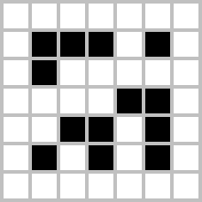
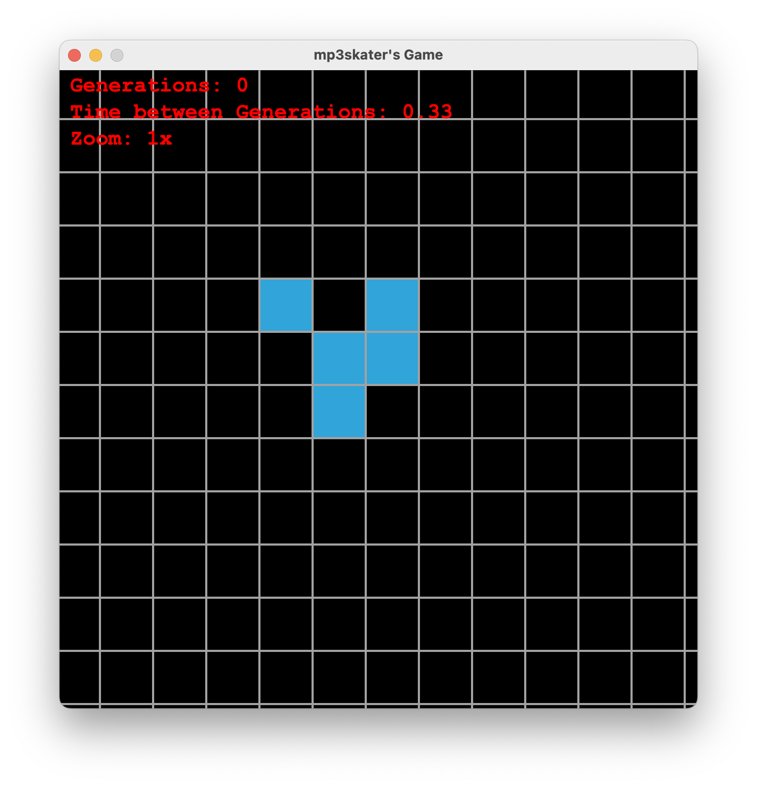
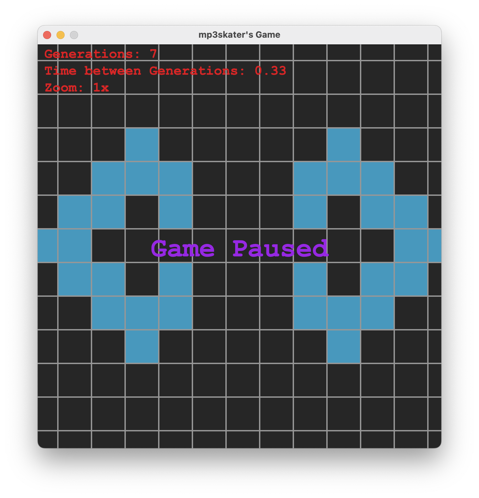

<h1 align="center">
   
  The Game of Life
</h1>

> A simple game that doesn't pose any restrictions to your creativity :)

What is the Game of Life?

## Features

--> Info: I created this game to challenge myself as I only used my prior projects and a online search of the rules.

**Added Features:**

- A (basicly) infinite map
- Effizient code
- Custom starting

**In Future:**

- More customization-options
- Zoom
- Configure Cells while running

[➜ For more details look the Wikipedia-page](https://github.com/Tschipcraft/more_mobs/wiki)

Glider                                                                                                    |  Game paused
:--------------------------------------------------------------------------------------------------------:|:-------------------------:
   |   

---

## Installation

To use your own starting board replace the file: "res/board/board.txt", everything other then SPACE will be an alive cell.

### Latest Release

Get the latest builds of GetOP [from the GitHub Releases](https://github.com/mp3skater/GetOP-mod-data/releases).

## License

This project is open source and licensed under the [MIT](/LICENSE) License.
